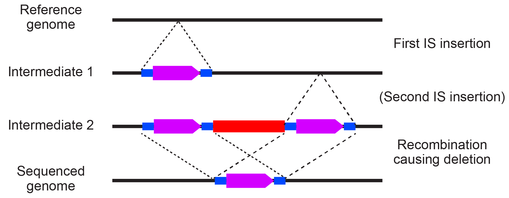
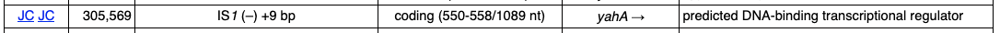
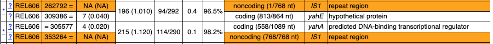

[Back to the Main Curation Tutorial Page](tutorial-curation.md)

This is a sort of bestiary of common curation cases and how to resolve them.

You'll want to keep the [GenomeDiff File Format specification](genomediff-file-format.md) 
handy for understanding how we manually curate mutation entries.

## IS element insertion plus adjacent IS-mediated deletion

IS elements (simple bacterial transposons) are are often drivers of microbial evolution.
They can insert into genes and disrupt their function. Because multiple copies of IS 
elements in a genome also provide homologous sequences for recombination, they also catalyze
deletions. In longer evolution experiments, multi-step events can occur where a new IS copy
inserts at a location and then there is recombination between that copy and another new IS
element insertions nearby, resulting in a deletion that leaves behind one IS copy.

!!! note
    You will only get clean predictions of IS element endpoints if they are annotated in
    your reference genome. It is highly recommended that you do this! For more information, 
    see [Reference Sequence File Formats](reference-sequence-file-formats.md).

For these events, you will typically see three unassigned evidence items, two **JC**
items that are between unique positions in the genome and opposite sides of the same
IS element and one **MC** item that indicates the region between the corresponding
reference positions where the IS elements inserted has been deleted in the sample.

How do we annote these events in the GenomeDiff file so that we can generate the resulting
genome sequence AND properly count the number of IS element insertion events that have occurred in the
lineage leading to the sequenced genome?

Three different cases are possible.

### Case 1: First IS element insertion is on the left side of the deletion

This situation looks like this:
<figure></figure>

The parentheses around Intermediate 2 indicate that this may be a short-lived
intermediate. That is, the second IS element insertion and the deletion may
happen at the same time. Maybe the new IS element inserts and during repair of
an IS insertion intermediate and homologous recombination chooses the other copy
as a template, resulting in loss of the region between and one IS copy in the
repaired genome.

### Example from the LTEE

Here's a concrete example of how we annotated one of these event that occurred in population
A–5 from the _E. coli_ LTEE.

First, we sequenced an earlier genome (A–5 50000-generation Clone REL11340) and see this IS element insertion predicted by _breseq_:

**MOB Mutation (A–5 50000-generation Clone REL11340)**
<figure></figure>

Second, we sequenced a later genome (A–5 75000-generation Clone B). In the _breseq_ results, we don't see the IS element insertion anymore. Instead, we see the **MC** and matching **JC** unassigned evidence items indicative of an IS element insertion followed by an IS-mediated deletion.

**Unassigned MC Evidence (A–5 75000-generation Clone B)**
<figure></figure>

**Unassigned JC Evidence (A–5 75000-generation Clone B)**
<figure></figure>

Notice how the **JC** connect the nucleotides before and after the boundaries of the **MC** to opposite
sides of the IS<i>1</i> element.

We would annotate this event with two lines in the GenomeDiff file:
```text
MOB	1000	.	REL606	305569	IS1	-1	9
DEL	1001	.	REL606	305569	3817	mediated=IS1	within=1000:2
```

There's an advanced GenomeDiff tag being used here: `within`. The syntax for this is `within=mutation_id:copy`. It is separated from the rest of the line by a tab.

The `within` information is necessary because  `gdtools APPLY` will first add the IS<i>1</i> element insertion with a nine-base pair duplication. After this, there are two different places that have the original coordinates 305569-305578 in the genome that is being constructed, one before and one after the new IS1 element insertion. We need the deletion to begin within the second of these coordinates so it is after the IS element and removes the newly duplicated bases.

Alternately, you can annotate the mutations in this way:
```text
MOB	1000	.	REL606	305569	IS1	-1	9
MOB	1001	.	REL606	309386	IS1	-1	9	before=1002
DEL	1002	.	REL606	305569	3826	between=IS1	within=1000:2	apply_size_adjust=-9
```

This latter method should be used if you have sequenced other genomes from the
same population and found some that have both IS element insertions but not the
deletion between them (ones that look like _Intermediate 2_).

There's a *lot* going on here, which is why you'd normally do the simpler method above if possible.

First, we added the `before=1002` tag to make sure the second **MOB** occurs before the deletion, because we need to remove the IS element and its left-side target site duplication with the deletion. (These tags have the syntax `before=mutation_id`). Second, the size of the **DEL** is increased by nine base pairs (3817 + 9 = 3826). This allows the **DEL** to include the size of the second **MOB** when it is being applied (because its start is before where that inserts and its end is after where it inserts). Third, we use a special `apply_size_adjust=-9` tag to decrease the size of the deletion by the size of the target site duplication of the second **MOB**. (These tags have the syntax `apply_size_adjust=offset`.) This makes it so we don't delete the second copy of the target site deletion, because those bases (309386-309396) are preserved. We can't do this by decreasing the size of the **DEL** because then it would completely contain and delete the second **MOB**.

!!! note
    While both of these will result in the same final genome sequence if
    you use them with `gdtools APPLY` There is a subtle difference in how _breseq_
    will analyze the resulting files with `gdtools COUNT`. In the first case, with
    two lines it will count two mutations, because it assumes that the second IS
    element insertion and the deletion happened as one event. In the second case it
    will count three mutations. In both cases, it will count that there were two
    new IS element insertions involved in those mutations. A further assumption of the
    second method is that we know the duplication size of the second IS<i>_1_</i> insertion.

### Case 2:  First IS element insertion is on the right side of the deletion

What if the IS element insertion on the right had occurred first?

The situation would look like this:
<figure></figure>

We would annotate this event with two lines in the GenomeDiff file.
```text
MOB	1000	.	REL606	309386	IS1	-1	9
DEL	1001	.	REL606	305578	3817	mediated=IS1	within=1000:1
```
Here the DEL overlaps the first copy of the IS target site duplication.

### Case 3: No information about the first IS insertion

Sometimes you will only have the sequence of the final sample. In this case, you can't
unambiguously annotate the details of the *first intermediate*. In this case, we recommend
annotating the left IS element first with a target site insertion of zero base pairs 
(essentially indicating it is unknown). Then annotate the deletion to the right of it.

For the example above, you would use this:
```text
MOB	1000	.	REL606	305569	IS1	-1	0
DEL	1001	.	REL606	305570	3808	mediated=IS1
```

Notice that we don't need the `within` tag because we moved the position where the deletion
begins to right after the IS element and it has zero for the target site duplication. We also
decreased the size of the deletion by 9 bases relative to the above scenarios because
we do not need to delete the nine duplicated target site bases (they are never added).

## Gene conversions of rRNA operons or other repeats

To be added!

## Duplications/Amplifications

To be added!

**Next:** [Curating _E. coli_ LTEE genomes](tutorial-curation-ecoli-ltee.md)