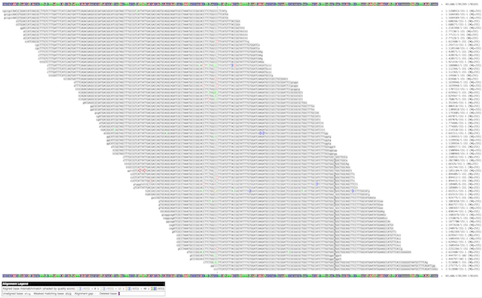
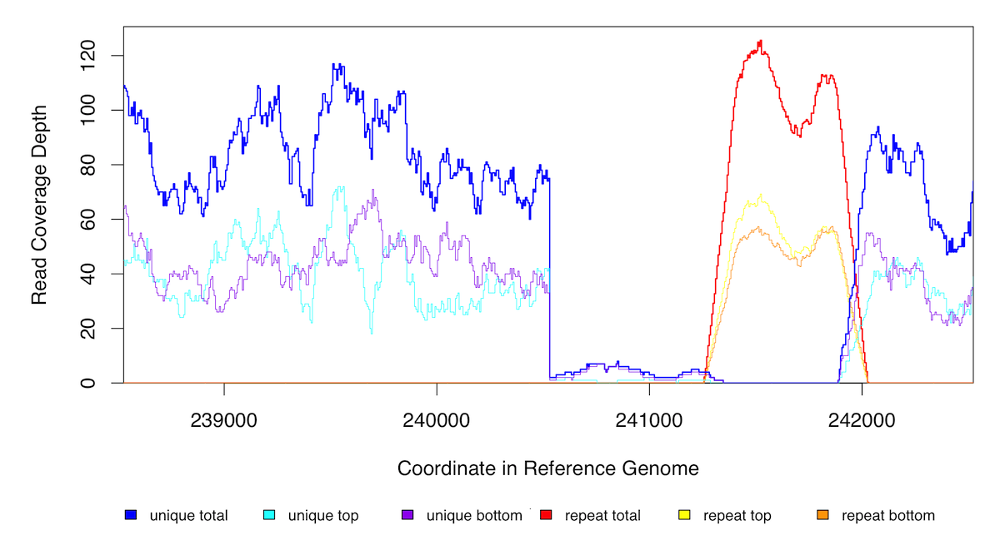

[Back to the Main Curation Tutorial Page](tutorial-curation.md)

The curation cycle begins with examining the HTML output of _breseq_ and trying to figure out what has happened.

## Exploring aligned reads

The `run/data` folder includes full information about how reads were aligned to the reference genome in `BAM` format and a version of the reference genome that has been converted to `GFF3` format. You can use these files to further explore the aligned reads, which can be helpful when resolving certain types of mutations or unexpected discrepancies between samples in the presence/absence of a specific mutation.

## _breseq_ utility subcommands

You'll generally want to run these commands from a directory that includes the `data` folder output by _breseq_ within it. This saves you from having to specify the paths to the `BAM` and `GFF3` files.

### `breseq bam2aln`

The first _breseq_ utility subcommand creates an HTML alignment of reads overlapping the specified coordinates. Run it with no arguments to se the help.

```bash
breseq bam2aln
```

Let's examine data from this clone: A+6_75000_gen_LTC-0000023. 

The `marginal.html` output file only links to the top 20 (by freqency) RA alignment items, but you'll find many more in the GenomeDiff file. For example, there is this one:
```
RA	3530	.	REL606	1701543	0	C	G	bias_e_value=8.48372	bias_p_value=1.83241e-06	consensus_reject=FREQUENCY_CUTOFF	consensus_score=125.3	fisher_strand_p_value=1.07499e-07	frequency=2.143e-01	ks_quality_p_value=1	major_base=C	major_cov=14/41	major_frequency=7.857e-01	minor_base=G	minor_cov=15/0	new_cov=15/0	polymorphism_frequency=2.143e-01	polymorphism_score=12.7	prediction=polymorphism	ref_cov=14/41	total_cov=35/41

```
We can use `bam2aln` to create an alignment of reads overlapping this position (or any other).

Run this command from within the directory containing the _breseq_ `data` output folder for this run.
```bash
breseq bam2aln REL606:1701543-1701543
```

The format is `seq_id:start-end`. 

In this case `REL606` is the sequence id (seq_id) for the chromosome of _E. coli_ in our input reference sequence file. If you are unsure what the `seq_id` is for your reference genome (or a contig or plasmid), open up the GFF3 file and look at it.

Here's a small preview of the output in the file `REL606:1701543-1701543.png`:


Click [here](images/Tutorial_Curation_BAM2ALN_REL606_1701543-1701543.png) to see the full-size image.

!!! warning
    You don't want start and end to be very different for this command, as the number of reads can become very large that overlap a large region. There is a `--max-reads` setting that is only 200 by default that you can adjust upwards if you get a message that only 200/N reads are shown and want to see more.

### `breseq bam2cov`

The second _breseq_ utility subcommand creates coverage plot of reads overlapping the specified coordinates. Run it with no arguments to see the help.

```bash
breseq bam2cov
```

Again, let's examine data from this clone: A+6_75000_gen_Clone_B_LTC-0000023. There's something going on with an unassigned junction near position 240,527 in the _yafT_ gene. Let's check out the coverage.

```bash
breseq bam2cov REL606:238527-242527
```

Here's the output in the file `REL606:238527-242527.png`:


The red line shows coverage of reads that map multiple places in the reference genome equally well. The blue lines are for places where reads uniquely align to this region. What we can see is that there is actually a deletion here, but it was missed by _breseq_ because the coverage doesn't quite go to zero. Fortunately, the unassigned junction tells us how to connect things (and is what is leading to the sharp cliff on the left side), so we can curate the results to correctly annotate the deletion.

If you examine the results for  A+6_75000_gen_Clone_A_LTC-0000024, which also has the same mutation, it is called fully by _breseq_ in that sample.

There is also a handy "tiling" mode for `bam2cov` which outputs zoomed in coverage files. Scanning through these can help you notice types of mutations that may not be detected automatically by _breseq_ and require curation. Currently, this includes duplications/amplifications that are caused by recombination between elements that are longer than the reaad length (commonly IS-element copies).

The syntax looks like this (when run from the main directory containing `data`):
```bash
mkdir cov
breseq bam2cov -x cov/tile --tile-size 10000 --tile-overlap 2000 -p 1000 -a
```
Notice that we are creating a new directory called `cov` to put all the output into.

With these options, each plot has a width of 10,000 base pairs plotting 1,000 total points, and adjacent plots overlap by 1,000 base pairs (half of the 2,000 option on each side). The `-a` means to show the average coverage across the whole genome as a horizontal line. Because the scale of each plot can change, having this line in all the plots can make it easier to notice changes. 

To keep the scales the same across all the plots, you can use an additional `-s` option (read the help to understand what value to use). To make the output less cluttered, you can also use the `-1` option to only show the total coverage (and omit showing separate lines for top-strand and bottom-strand coverage).

## Using IGV

The Integrative Genomics Viewer (IGV) allows you to view aligned reads interactively (you can scroll around and change how they are displayed. Any _breseq_ run creates the files you need to load to do this in the `data` folder.

See the [relevant section of the _breseq_ manual](output.md#viewing-output-aligned-reads-in-the-igv) to learn how!

**Next:** [Automating the curation cycle using _brefito_](tutorial-curation-automating.md)

