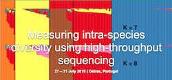

Acknowledgments
================

Developers
------------

* `Jeffrey E. Barrick <http://barricklab.org>`_
* Jordan Borges
* Geoffrey Colburn
* Daniel E. Deatherage
* Tyler Fields
* `David B. Knoester <http://www.users.miamioh.edu/knoestdb/>`_
* Matt Strand
* Aaron Reba
* `Austin G. Meyer <http://www.meyerresearch.com>`_
* Alex Hu

|breseq| was initially developed at Michigan State University while Jeff was a postdoc with Richard Lenski and Charles Ofria, and while Dave was a graduate student in the lab of Philip McKinley. Dave, Jordan, Geoff, and Aaron were instrumental in the transition from a slow and nonportable Perl pipeline into the current C++ implementation.

|breseq| is now developed in the Barrick lab in the Department of Molecular Biosciences at the University of Texas at Austin. `Lab Website <http://barricklab.org>`_ 

Testing
------------

We thank Zachary Blount, Jim Bull, Tim Cooper, Grace Ellis, Tara Gianoulis, Adam Feist, Aleeza Gerstein, Dan Goodman, J.P. Jerome, Megan Larsen, Maria Elena Martino, Ranno Nahku, Hanspieter Niederstrasser, Elizabeth Perry, Patrick Phaneuf, Alexandre Santos Almeido, Gerda Saxer, Daniel Sobral, Saad Syed, William Trimble, Sébastien Wielgoss, participants in Titus Brown's 2010 summer course in next-gen sequencing at the Kellogg Biological Station, participants in the EMBO Practical Course on Measuring intra-species diversity using high-throughput sequencing, and many many others for providing bug reports, feedback on |breseq| usage, and datasets for testing!

We thank Brian Wade and Matthew Paff for providing Cygwin installation instructions.

Funding
-----------

The following grants have supported development of |breseq| and associated tutorial materials:

#. National Institutes of Health (2009-2010). Pathway to Independence Award [K99/R00GM087550 to J.E.B.]
#. National Science Foundation (2007-2008). Postdoctoral Fellowship in Biological Informatics [DBI-0630687 to J.E.B.]
#. National Science Foundation (2010). BEACON Center at Michigan State University [DBI-0939454 subcontract to J.E.B].
#. Cancer Prevention & Research Institute of Texas (CPRIT) (2014-2015) [RP130124 to J.E.B.]
#. University of Texas at Austin CPRIT Research Traineeship (2013-2015) [to D.E.D.]
#. EMBO Practical Course `Measuring intra-species diversity using high-throughput sequencing <http://events.embo.org/15-htp-sequencing/>`_ held 27–31 July 2015 in Oeiras, Portugal

