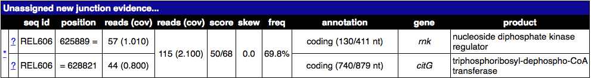
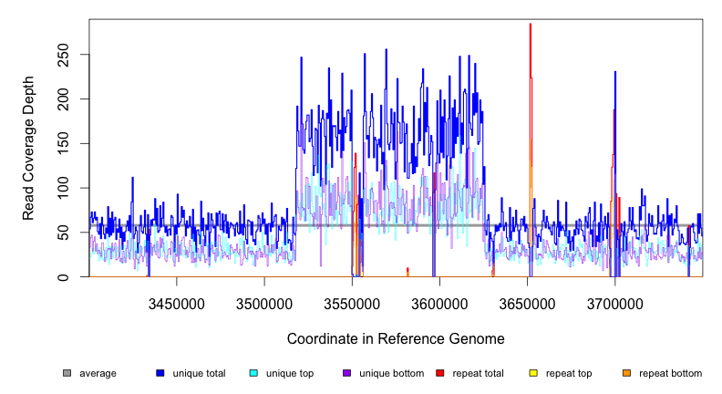
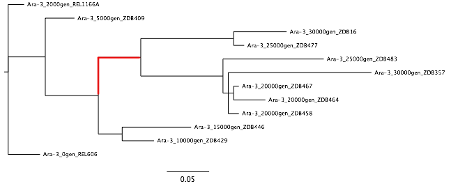

.. _tutorial-clones:

Tutorial: Clonal Samples (Consensus Mode)
=========================================

This tutorial expands on the :ref:`test-drive`. You will analyze mutations in the genomes of multiple clones isolated from population Ara-3 of the Lenski long-term evolution experiment (LTEE). A complex mutation is present in these samples that was necessary for evolution of the aerobic citrate utilization trait (Cit+). In addition to some tips on |breseq| usage and examples of interpreting more complex mutations in the output, this tutorial also introduces functionality in the |gdtools| utility command that can be used to compare and analyze mutations in an entire set of evolved genomes.

.. note::

   This tutorial was created for the EMBO Practical Course `Measuring intra-species diversity using high-throughput sequencing <http://events.embo.org/15-htp-sequencing/>`_ held 27–31 July 2015 in Oeiras, Portugal.
   
.. warning::

   If you encounter any |breseq| or |gdtools| errors or crashes in running this tutorial, please `report issues on GitHub <https://github.com/barricklab/breseq/issues>`_.

1. Download data files
---------------------------------

First, create a directory called ``tutorial_clonal``:

.. code-block:: bash

   $ mkdir tutorial_clones
   $ cd tutorial_clones

Reference sequence
++++++++++++++++++++

|breseq| prefers the reference sequence in `Genbank <http://www.ncbi.nlm.nih.gov/Sitemap/samplerecord.html>`_ or `GFF3 <http://gmod.org/wiki/GFF>`_ format. In this example, the reference sequence is *Escherichia coli* B strain REL606. The Genbank (Refseq) accession number is: **NC_012967**. For this tutorial, we are going to use an updated version of this file that contains richer gene annotation information than the version available from NCBI.

* `Download REL606.gbk via this link <http://barricklab.org/release/breseq_tutorial/REL606.gbk.gz>`_

Read files
++++++++++++++

In this tutorial, we're going to use Illumina genome re-sequencing data from *E. coli* strains that evolved for up to 40,000 generations in population Ara-3 from the Lenski long-term evolution experiment [Blount2011]_. This data is available in the European Nucleotide Archive (ENA). Go to http://www.ebi.ac.uk/ and search for one of the genomes in the table below (or click on the accession number to be taken directly to the download page for that clone).

.. csv-table::
   :header: "Accession", "Clone", "Description"
   :widths: 10, 10, 50

   `SRR098289 <http://www.ebi.ac.uk/ena/data/view/SRR098289>`_ , "ZDB564", "Cit+ clone isolated at generation 31,500"
   `SRR098042 <http://www.ebi.ac.uk/ena/data/view/SRR098042>`_ , "ZDB172", "Cit+ clone isolated at generation 32,000"
   `SRR098040 <http://www.ebi.ac.uk/ena/data/view/SRR098040>`_ , "ZDB143", "Cit+ clone isolated at generation 32,500"
   `SRR097977 <http://www.ebi.ac.uk/ena/data/view/SRR097977>`_ , "CZB152", "Cit+ clone isolated at generation 33,000"
   `SRR098026 <http://www.ebi.ac.uk/ena/data/view/SRR098026>`_ , "CZB154", "Cit+ clone isolated at generation 33,000"
   `SRR098034 <http://www.ebi.ac.uk/ena/data/view/SRR098034>`_ , "ZDB83", "Cit+ clone isolated at generation 34,000"

Download the FASTQ files for your chosen sample into your **tutorial_clones** directory.

These particular clonal isolates were chosen to illustrate particular aspects of interpreting `breseq` output. If you would like to investigate data corresponding to any of the 29 sequenced genomes from this population described in [Blount2011]_ check out `SRP004752 <http://www.ebi.ac.uk/ena/data/view/SRP004752>`_.


2. Run |breseq|
-----------------------

Check to be sure that you have changed into the **tutorial_clones** directory, that you have all of the input files, and that you have decompressed these files.

Now, run breseq using a command of this form (replacing strain numbers and FASTQ file names as appropriate):

.. code-block:: bash

   $ breseq -l 60 -j 8 -o ZDB83_output -r REL606.gbk SRR098034.fastq

.. note::

   We are using the **-l 60** option to limit the amount of read data that we use to a nominal coverage of 60-fold to speed up this |breseq| run. Generally, setting this option to somewhere in the range of 80 to 120 is recommended. In our experience, using more read data than that is usually not helpful for analyzing clonal samples. It just slows down the analysis!

What is the **-j** option doing?

.. container:: toggle

   .. container:: header

      **Click on the triangle to reveal the answer**

   .. container:: text

      You can show the most commonly used |breseq| options by calling it with no arguments, and you can show all options by adding the **-h** flag. 

   .. code-block:: bash

      $ breseq
      $ breseq -h

3. Open |breseq| output
----------------------------

Using a web browser, open the file ``index.html`` in the output directory. This file contains tables describing the predicted mutations and also evidence that may indicate that there are other mutations that |breseq| could not resolve into precise genetic changes that you should further examine. The tables in this HTML file are more fully described in the :ref:`output-format` section of the |breseq| manual.

.. note::

   If you run into problems generating the |breseq| output and would like to continue this tutorial, please `download pre-generated results for ZDB83 <http://barricklab.org/release/breseq_tutorial/ZDB83_output.tgz>`_ (created using `breseq` version 0.26.1).

Now, browse the upper table in the results of **Mutation predictions**. Click on **RA**, **JC**, and **MC** links to view the evidence `breseq` used to predict these mutations. There should be a variety of base substitutions, indels, large deletions, and transposon (IS element) insertions in your results.

Consider these questions:

1. Click on the **MC** link on the line for a large deletion that is mediated by an IS element or between IS elements (look in the **annotation** column). What are the red and blue lines on the coverage graphs?

.. container:: toggle

   .. container:: header

      **Click for an example of an IS-mediated MC evidence item**

   .. container:: text

      .. figure:: images/ZDB83.waaT.IS-mediated-deletion.png
 
.. container:: toggle

   .. container:: header

      **Click to reveal the answers**

   .. container:: text

      Blue lines are coverage from uniquely mapped reads.  Red lines indicate coverage from reads that map equally well to genomic repeat regions that also exist elsewhere in the genome. You should see red coverage on one or both sides of the deletion that correspond to the  IS elements because these transposons occur in mutliple identical copies around the genome. The read length is too short to tell which copy a read came from if it maps to the middle of these elements. They are hich have lengths of around 1000-1500 base pairs).

Next, scroll down to the **Unnassigned...** tables that are near the bottom of the page. Click on a few of these evidence items and examine the read coverage depth or alignment of mapped reads. Can you tell which **MC** items are associated with **JC** items and what mutations may have happened in the evolved genome? This can take practice, so we'll work a few examples. 

2. Find an **Unassigned missing coverage evidence** entry in an *rhs* or *rrl* gene. Examine the read coverage graph. What is the most likely mutation here?

.. container:: toggle

   .. container:: header

      **Click for an example rrlA MC image**

   .. container:: text

      .. figure:: images/ZDB83.rrlA.MC.png

.. container:: toggle

   .. container:: header

      **Click to reveal possible answers**

   .. container:: text

      These variants apparently missing small segments of uniquely mapped reads in a mostly repetitive region are most likely explained by non-allelic gene conversions. Recombination converts one copy of the near-repeat to have the exacts sequence of another copy of the near-repeat. Since we are mapping reads to the reference genome, this makes it appear that the sequence here was deleted, when it was just changed to mirror the other copy exactly. If you looked at the coverage of the other copy, then you would likely see correspondingly higher coverage at any unique segments.

3. Can you find a situation where an observed **Unassigned missing coverage evidence** item also has junctions to new IS elements on each of its boundaries? What mutation event or events could explain this genetic variant?

.. container:: toggle

   .. container:: header

      **Click for an example of an unassigned MC image of this kind**

   .. container:: text

      .. figure:: images/ZDB83.ECB02816-ECB02836.MC.png


.. container:: toggle

   .. container:: header

      **Click to reveal possible answers**

   .. container:: text

      In general, if you see sharp drops to zero of blue (unique) coverage on both margins of the deletion, then there will be two junctions to a transposable IS element, one for each side of the deletion. Thus, in the sequenced genome there is one copy of the IS element bridging between the ends of the deleted region. The two mutations that led to this final genome are likely first an insertion of one copy of the IS element, then an insertion of another IS element copy in the same orientation, followed by a deletion between them that also removes one IS copy by homologous recombination between; or, alternatively, an IS mediated deletion adjacent to the new IS copy. By examining other clones in the population, it may sometimes be possible to find out the location of the first IS element insertion if it is ever observed separately before the deletion.

      In this case, these two JC evidence items in the unassigned table are the ones that correspond to two sides of a transposable element (IS*150* copy).

      .. figure:: images/ZDB83.ECB02816-ECB02836.JC.png

.. note::

   If you'd like to explore the mapped reads in more detail than is possible by looking at the alignments and coverage graphs that |breseq| automatically generates, read the section of the manual on :ref:`viewing-in-IGV`.

4. Resolving the Cit+ mutation
------------------------------

The mutation that caused the Cit+ phenotype encompasses the *citT* gene (which encodes a citrate:succinate antiporter). It is detected as an **unassigned JC** evidence item in the |breseq| results (found in a table lower on the results page). It also leads to a change in coverage in this region of the genome. Your task now is to figure out what mutation or mutations gave rise to the evolved genome architecture.

The steps that can be used to find the answer are illustrated using ZDB83 as an example, but details of the evolved *citT* arrangement are different in each of the example genomes. Be sure to pay attention to what is actually happening in your results!

A. *rnk-citG* junction
++++++++++++++++++++++
Find the junction annotated as *rnk-citG* in the **Unassigned Junction** table. It should look something like this.



What does this junction mean? What regions of the genome are juxtaposed in a way that they were not in the reference genome?

.. container:: toggle

   .. container:: header

      **Click to see the answer**

   .. container::

      The junction means that reads connect position 625889 (extending to higher coordinates) to position 628821 (extending to lower coordinates). Don't get what this means? Click on the \* link and it will show the two snippets of reference genome and how they are joined by split-read alignments across the junction. The image below also shows what the new arrangement would look like. It's evidence for a tandem head-to-tail amplification.

   .. figure:: images/ZDB83.rnk-citG.JC.schematic.png
      :width: 800px


B. Zoomed-in coverage
+++++++++++++++++++++++
If the region is duplicated (or amplified to even more copies) then there should also be an increase in the genomic coverage of this region. Use the **breseq BAM2COV** subcommand to create a zoomed-in view of this region to try to better discern its boundaries and copy number. Alternatively, you can navigate to this region of the genome by loading the |breseq| output in IGV (as described above).

You can get the help by running this command:

.. code-block:: bash

   $ breseq BAM2COV -h

Here's an example of applying **BAM2COV** to one of these genomes (In this case, by running it from inside the |breseq| output directory, we can use a simpler version of the command that leaves off some options and has extra information available about the average coverage across the genome):

.. code-block:: bash

   $ cd ZDB83_output
   $ breseq BAM2COV -a REL606:624500-630500

Here's an example of the corresponding output:



C. Add the amplification to the `GenomeDiff` file
+++++++++++++++++++++++++++++++++++++++++++++++++

|GenomeDiff| files are text files output by |breseq| that describe all of the mutations detected in a sample. (They're like "diff" files for code, describing just the small number of changes needed to "patch" a text file to create an updated version.) |GenomeDiff| files contain similar information to VCF files describing genetic variants, but they are more focused on describing mutational events. They make it possible to (1) easily annotate structural variants such as transposon insertions and amplifications, (2) include gene annotation information, and (3) set the order with which to apply mutations, which is sometimes necessary to fully describe evolutionary data. The |gdtools| command exists to perform various functions on |GenomeDiff| files, as we'll see in the next few sections (much like the **vcftools** command) .

Since |breseq| could not resolve the *rnk-citG* amplification, this very important mutation is not present in the |GenomeDiff| output file, so it won't be included in downstream analysis steps unless you edit this file and add a description of the event to the output.

To illustrate how to do this, make a copy of the file ``output/output.gd`` from the |breseq| output directory for your run. Name it something like ``ZDB83.gd`` and keep it outside of the |breseq| output folder. If you change your working directory back to ``tutorial_clones``, then a command like this will manage that:

.. code-block:: bash

   $ cp ZDB83_output/output/output.gd ZDB83.gd

Open this file in a text editor to see how it represents mutations and other information that is in the HTML output files in a parsable format. Refer to :ref:`genomediff-usage` for a full description of the |GenomeDiff| appendix of the |breseq| manual for a full description of the file format.

Let's add an **AMP** line describing the *rnk-citG* amplification to our new ``ZDB83.gd`` file. You can add this line anywhere in the file.

.. container:: toggle

   .. container:: header

      **Try to do this yourself. Here's a hint to get you started**

   .. container:: 

      The line should start this way:

   .. code-block:: text

      AMP	.	.	REL606	<insert additional columns here!>

   The *1st column* defines the type of mutation as an **AMP**. The *2nd and 3rd columns* are IDs that don't have to be set for manually added mutations. They enable one to link mutations and evidence items that support them. Using a dot or period (**.**) just signifies that you are leaving them blank. The *4th column* is the **seq_id** identifying the reference sequence fragment on which the mutation is located. There's only one choice for this *E. coli* with a single chromosome: **REL606**.

.. container:: toggle

   .. container:: header

      **Here's the answer for ZDB83**

   .. code-block:: text

      AMP	.	.	REL606	625889	2933	4

   .. container::

      The *5th column* is the starting coordinate of the amplification (straight from the **JC** evidence). The *6th column* is the size of the amplification (calculated as 628821 - 625889 + 1 = 2933 in this case). The *7th column* is the new copy number of this region in the mutated genome (4 copies in this case).

You can run **gdtools VALIDATE** to check your syntax for errors. For example, using the command:

.. code-block:: bash

   gdtools VALIDATE -r REL606.gbk ZDB83.gd

5. Generating a mutated reference sequence
---------------------------------------------------------------------
If you manually edit |GenomeDiff| files to resolve evidence into new mutations, it's best to check that you've described the mutations correctly in your curated file (with the right start positions, size, variant bases, etc). You can do this by simulating the mutant genome that you have described in the |GenomeDiff| file and then re-querying the sequencing read data against it in a second |breseq| pass. Ideally, no variants will be detected when you do this if your list of mutations is complete! It's also possible that mapping to this mutated reference genome will enable you to detect new variants – because reads that did not match the original genome sufficiently well now map to the mutated reference sequence.

Use a command like this to generate the mutant genome sequence:

.. code-block:: bash

   gdtools APPLY -f GFF3 -o ZDB83.gff3 -r REL606.gbk ZDB83.gd

Now start a new `breseq` run using a command like this:

.. code-block:: bash

   breseq -j 4 -l 60 -o ZDB83_mutated_output -r ZDB83.gff3 SRR098034.fastq

Wait for this to run and then examine the output (you probably want to continue this tutorial in another window while you wait for that command to complete). 

You should see the all of the previously predicted mutations and the *rnk-citG* junction disappear in the new output! If you make a coverage plot of the *citT* gene and the surrounding region, the coverage will also now be in red, indicating that reads no longer uniquely map to it because there are now multiple copies.

Note that coordinates of genes are shifted in the mutated reference genome due to mutations! If you want to find out where the *citT* gene copies are located to use **gdtools BAM2COV**, you can use this command to show the relevant lines of the GFF3 reference file:

.. code-block:: bash

   grep citT ZDB83.gff3

6. Characterizing genetic diversity and genome evolution
---------------------------------------------------------------------
At this point in the tutorial, you can branch off and explore multiple topics related to understanding genome evolution in this *E. coli* population. Normally, you would generate the "raw" |breseq| output for all of the genomes in this population and curate these |GenomeDiff| files to resolve unassigned evidence. This can be a very time-consuming process (the |breseq| runs themselves, but especially getting all of the details correct for resolving the unassigned evidence).

So, to get the most out of this tutorial in the shortest amount of time, please continue by `downloading curated GenomeDiff files <http://barricklab.org/release/breseq_tutorial/curated_gd.tgz>`_ for the 29 clones from this population described in [Blount2011]_.

Place this archive inside of your ``tutorial_clones`` directory. Decompress and change into the resulting directory, which is full of the curated |GenomeDiff| files.

.. code-block:: bash

   $ tar -xvzf curated_gd.tgz
   $ cd curated_gd

Note that these files have been edited in two ways from the raw `breseq` output. First, unassigned evidence has been resolved into mutations by manually editing the `GenomeDiff` files. Second, additional metadata has been added in the header sections. This data can be used by the |gdtools| utilities that will be demonstrated in these examples.

For example, the header of the file ``Ara-3_34000gen_ZDB83.gd`` looks like this:

.. code-block:: text

   #=GENOME_DIFF 1.0
   #=TIME	34000
   #=POPULATION	Ara-3
   #=TREATMENT	LTEE
   #=CLONE	ZDB83

Example 1. Compare mutations in different genomes
++++++++++++++++++++++++++++++++++++++++++++++++++

You can generate a table that enables you to compare the presence/absence of the mutations in multiple genomes using the **gdtools COMPARE** command. Let's generate a comparison table including the 4 the genomes from generations 15,000 and earlier. Try to figure out how to do this from the help:

.. code-block:: bash

   gdtools COMPARE -h

.. container:: toggle

   .. container:: header

      **Here's an example command**

   .. code-block:: bash

      $ gdtools COMPARE -o ../compare.html -r ../REL606.gbk Ara-3_2000gen_REL1166A.gd Ara-3_5000gen_ZDB409.gd Ara-3_10000gen_ZDB429.gd Ara-3_15000gen_ZDB446.gd

Answer these questions from the **gdtools COMPARE** output:

1. In what order did mutations in these four genes occur in the population: *fis*, *hslU*, *mrdB*, *ybaL*?

.. container:: toggle

   .. container:: header

      **Show the answer**

   .. container:: text

      *mrdB* (2000+ generations) < *hslU* and *fis* (5000+ generations) < *ybaL* (10000+ generations)

2. Do you see any mutations that are off the main line of descent? (That is, they only appear in one or more early clones from a lineage that appears to have later gone extinct, like from 2,000 or 5,000 generations.)

.. container:: toggle

    .. container:: header

        **Show me some examples**

    .. container::  text

       For example, mutations in the genes *eaeH*, *infB*, and *fadL*.

Example 2. Analyze rates and nature of genome evolution
+++++++++++++++++++++++++++++++++++++++++++++++++++++++++

You can count the number of mutations in each genome using the **gdtools COUNT** command. Try to figure out how to run it from the help:

.. code-block:: bash

   $ gdtools COUNT -h

.. note::

   Save yourself some typing by putting ```ls *.gd``` in your command line for the |GenomeDiff| arguments! The backticks run the enclosed command and insert the output into your command line. This requires that you run the command from inside the ``curated_gd`` folder.

.. container:: toggle

   .. container:: header

      **Here's an example command**

   .. code-block:: bash

      $ gdtools COUNT -o ../count.csv -r ../REL606.gbk `ls *.gd`

Open the comma-separated values (CSV) output file ``count.csv`` in a **spreadsheet program** or in **R**.

Answer these questions by loading the **gdtools COMPARE** output into **R**. It's easiest if you change back into your main ``tutorial_clones`` directory first.

.. code-block:: R

   > count = read.csv("count.csv", header=T)
   > head(count)

1. Is the rate at which mutations accumulate in these genomes constant over time in this population? Graph the total number of mutations in each genome (**total** column) versus the generation when it was isolated (**time** column).

.. container:: toggle

   .. container:: header

      **Show R commands**

   .. code-block:: R

      > plot(total ~ time, count)

   .. container:: toggle

      .. container:: header

         Here's the key thing to notice in the graph

      .. container:: text

         Some of the genomes from 36,000+ generations appear to have evolved an elevated mutation rate! They fall way above a line fit to the rest of the points.

2. There are 52 mutations in ZDB464, a clone isolated at 20,000 generations. If we did a separate evolution experiment under conditions of relaxed selection so that we were observing the spontaneous rate of mutations (i.e., a mutation accumulation experiment) and observed 47 mutations over 50,000 generations of evolution, could we conclude that the rate of genome evolution along the lineages leading to ZDB64 was faster or slower than the spontaneous mutation rate? What is the P-value for rejecting the null hypothesis of the same rate?

.. container:: toggle

    .. container:: header

        **Show a hint**

    .. container::  text

       This is count data, so you'll want to use a Poisson test. That's the ``poisson.test`` function in **R**.

.. container:: toggle

   .. container:: header

      **Show the R commands**

   .. code-block:: R

      > poisson.test( c(52, 47), c(20000, 50000))

      Comparison of Poisson rates

      data:  c(52, 64) time base: c(20000, 50000)
      count1 = 52, expected count1 = 33.143, p-value = 0.0001932
      alternative hypothesis: true rate ratio is not equal to 1
      95 percent confidence interval:
       1.381119 2.975263
      sample estimates:
      rate ratio 
        2.03125

   .. container:: text

      So, yes the rates differ significantly (P = 0.00019).

Example 3. Analyze unique mutations for evidence of bias and selection
++++++++++++++++++++++++++++++++++++++++++++++++++++++++++++++++++++++

Often, we only want to examine unique mutations within a population. Many of the mutations observed in the 5,000 generation clone are also found in the 20,000 generation clone, so just adding up the counts of mutations in each genome and then analyzing them for bias or selection would have a problem with pseudoreplication. Said another way, we don't want to count these mutations, which most likely only happened once in the population, as two independent observation supporting a hypothesis. One mutational event should count as one observation, no matter how many genomes it appears in.

To define the set of unique mutations, we can use the **gdtools UNION** command:

.. code-block:: bash

   $ gdtools UNION -h

You'll want to exclude those outlier genomes for this analysis (the ones which have evolved a high mutation rate). It's probably easiest to move or delete these three genomes from the ``curated_gd`` folder: ``Ara-3_36000gen_ZDB96.gd``, ``Ara-3_38000gen_ZDB107.gd``, and ``Ara-3_40000gen_REL10979.gd``.

.. container:: toggle

   .. container:: header

      **Show the gdtools command**

   .. code-block:: bash

      $ cd curated_gd
      $ gdtools UNION -o ../unique.gd `ls *.gd`

This time, run the **gdtools COUNT** on just the one resulting ``unique.gd`` file. **Important:** Include the **-b** option. This provides additional output of the total number of synonymous and nonsynonymous mutations possible in the genome.

.. container:: toggle

   .. container:: header

      **Show the answer**

   .. code-block:: R

      $ cd ..
      $ gdtools COUNT -b -o unique.csv -r REL606.gbk unique.gd

Now, load ``unique.csv`` into **R** to answer these questions:

1. Is the spectrum of base substitutions observed (A:T to G:C, A:T to C:G, A:T to T:A, etc.) different from a null hypothesis that these rates are uniform (that all six possible changes are equally likely)?

.. container:: toggle

   .. container:: header

      **Show a hint**

   .. container::  text

      We need to compare two models, one with the same rate for all six types of base substitutions and one in which there are different rates allowed for each base substitution. This is a hard one. Here are some of the tools you'll need to accomplish this in **R**:

   .. code-block:: R

      > count = read.csv("unique.csv", header=T)
      > head(count)

      # Define the categories and columns with the numbers that we will be using
      > base.substitutions = c("AT.GC", "AT.CG", "AT.TA", "CG.TA", "CG.AT", "CG.GC")
      > possible.columns = paste("POSSIBLE.TOTAL", base.substitutions,  sep=".")
      > total.columns = paste("OBSERVED.TOTAL", base.substitutions,  sep=".")

      # Create a data frame
      > base.sub = data.frame(type = as.factor(base.substitutions), possible = as.numeric(count[possible.columns]), total = as.numeric(count[total.columns]))

      # Now we have the data organized like this:
      > base.sub
         type possible total
      1 AT.GC  2279284    14
      2 AT.CG  2279284    23
      3 AT.TA  2279284     9
      4 CG.TA  2350528    37
      5 CG.AT  2350528    14
      6 CG.GC  2350528     3

      # To fit the single rate model (with no intercept), use glm()
      > one.rate = glm(total ~ possible + 0, data=base.sub, family=poisson())

.. container:: toggle

   .. container:: header

      **Show the rest of the answer**

   .. code-block:: R

      # Fit the six rate model, use glm()
      > six.rate = glm(total ~ possible + type + 0, data=base.sub, family=poisson())

      # Perform a likelihood ratio test to compare the model fits
      > anova(one.rate, six.rate, test="LRT")

      Analysis of Deviance Table

      Model 1: total ~ possible + 0
      Model 2: total ~ possible + type + 0
        Resid. Df Resid. Dev Df Deviance  Pr(>Chi)    
      1         5     42.182                          
      2         0      0.000  5   42.182 5.411e-08 ***
      ---
      Signif. codes:  0 ‘***’ 0.001 ‘**’ 0.01 ‘*’ 0.05 ‘.’ 0.1 ‘ ’ 1

   .. container::  text

      Therefore, the six rate model fits significantly better (P = 5.4E-8) , so we can reject the hypothesis that the rates of all six types of base pair substitutions are the same in this data set.

   .. warning::

      Be careful how you interpret these results! These are the rates at which mutations accumulate in the genomes **after they are filtered by selection**. They almost certainly do not represent the underlying rates at which new spontaneous mutations appear in the genomes of new cells in the population, which could be higher or lower.

2. Is there evidence of positive selection in the base substitutions that are observed in the evolving population (dN/dS > 1)?

.. container:: toggle

   .. container:: header

      **Show a hint**

   .. container::  text

      The observed dN/dS ratio can be calculated as:

   .. code-block:: R

      > count = read.csv("unique.csv", header=T)

      > dN = count$OBSERVED.NONSYNONYMOUS.TOTAL
      > dS = count$OBSERVED.SYNONYMOUS.TOTAL
      > dN/dS
      [1] 4.133333

   .. container::  text

      However, you need to calculate the expected dN/dS ratio to see if this is elevated with respect to chance. This requires an assumption about the base change spectrum. Why? There is a much higher chance that a G:C to A:T mutation will be nonsynonymous than a G:C to T:A mutation, for example. So we need to sum over the number of possible synonymous and nonsynonymous mutations given a spectrum of base substitutions. For simplicity, let's assume a 2:1 transition:transition ratio. 

.. container:: toggle

   .. container:: header

      **Show the next hint**

   .. container::  text

      Here's one way to calculate the expectation for dN/dS:

   .. code-block:: R

      > base.substitutions = c("AT.GC", "AT.CG", "AT.TA", "CG.TA", "CG.AT", "CG.GC")

      # This is a 2:1 transition to transversion ratio
      # because there are two transversion categories for each transition
      > rate.spectrum = c(4,1,1,4,1,1)

      > possible.dN.columns = paste("POSSIBLE.NONSYNONYMOUS", base.substitutions,  sep=".")
      > possible.dS.columns = paste("POSSIBLE.SYNONYMOUS", base.substitutions,  sep=".")

      > dN.expect = sum(count[possible.dN.columns] * rate.spectrum)
      > dS.expect = sum(count[possible.dS.columns] * rate.spectrum)

      > dN.expect/dS.expect
      [1] 2.320187

   .. container::  text

      You still need to calculate whether the observed dN/dS ratio (4.13) is significantly greater than the expected ratio (2.32). To do this, use **binom.test()**.

.. container:: toggle

   .. container:: header

      **Show the answer**

   .. code-block:: R

      > binom.test(c(dN, dS), p = dN.expect/(dN.expect + dS.expect))

      Exact binomial test

      data:  c(dN, dS)
      number of successes = 62, number of trials = 77, p-value = 0.04629
      alternative hypothesis: true probability of success is not equal to 0.6988121
      95 percent confidence interval:
       0.6991329 0.8866683
      sample estimates:
      probability of success 
                   0.8051948

   .. container:: text

      So the dN/dS ratio is marginally significantly different from expected with our assumed base mutation spectrum (P = 0.046).

      For a (much) more conservative test, we can assume that the underlying base change spectrum is represented by the observed base changes (essentially a randomization test that keeps the base changes equal and shuffles them to random protein-coding positons in the genome). The code to do this is as follows:

   .. code-block:: R

      > base.substitutions = c("AT.GC", "AT.CG", "AT.TA", "CG.TA", "CG.AT", "CG.GC")

      > possible.dN.columns = paste("POSSIBLE.NONSYNONYMOUS", base.substitutions,  sep=".")
      > possible.dS.columns = paste("POSSIBLE.SYNONYMOUS", base.substitutions,  sep=".")

      > observed.dN.columns = paste("OBSERVED.NONSYNONYMOUS", base.substitutions,  sep=".")
      > observed.dS.columns = paste("OBSERVED.SYNONYMOUS", base.substitutions,  sep=".")
      > total.dN.dS = count[observed.dN.columns] + count[observed.dS.columns]
      > total.dN.dS
        OBSERVED.NONSYNONYMOUS.AT.GC OBSERVED.NONSYNONYMOUS.AT.CG
      1                           10                           19
        OBSERVED.NONSYNONYMOUS.AT.TA OBSERVED.NONSYNONYMOUS.CG.TA
      1                            7                           27
        OBSERVED.NONSYNONYMOUS.CG.AT OBSERVED.NONSYNONYMOUS.CG.GC
      1                           11                            3

      > dN.expect = sum(count[possible.dN.columns] * total.dN.dS)
      > dS.expect = sum(count[possible.dS.columns] * total.dN.dS)

      > dN.expect/dS.expect
      [1] 2.676483

      > binom.test(c(dN, dS), p = dN.expect/(dN.expect + dS.expect))
      
         Exact binomial test

      data:  c(dN, dS)
      number of successes = 62, number of trials = 77, p-value = 0.1581
      alternative hypothesis: true probability of success is not equal to 0.7280009
      95 percent confidence interval:
       0.6991329 0.8866683
      sample estimates:
      probability of success 
                   0.8051948 

   .. container:: text

      As you can see, the dN/dS ratio is not significantly different from expected by this test. This is a very stringent test because positive selection (favoring an elevated dN/dS ratio) should actually alter the observed base spectrum from the underlying mutational spectrum. It will tend to favor transversions over transitions, because they are more likely to change the encoded amino acid.

Example 4. Build a phylogenetic tree of population Ara-3
+++++++++++++++++++++++++++++++++++++++++++++++++++++++++

You can use **gdtools COMPARE** and the `Phylip package <http://evolution.genetics.washington.edu/phylip.html>`_ program **dnapars** to create a maximum parsimony phylogenetic tree |GenomeDiff| files.

At first, let's just use a subset of the genomes through 30,000 generations. Move the others out of the ``curated_gd`` folder. We'll keep the ancestral genome with no mutations (REL606) to use as the outgroup in rooting this tree. 

See if you can figure out how to make a Phylip format output file from **gdtools COMPARE**:

.. code-block:: bash

   gdtools COMPARE -h

.. container:: toggle

   .. container:: header

      **Show example code**

   .. code-block:: bash

      $ cd curated_gd
      $ gdtools COMPARE -f phylip -o ../infile -r ../REL606.gbk `ls *.gd`

Examine the output file from **gdtools COMPARE** in a text editor. It consists of **phylip** input shown as nucleotides with a column for every unique mutation observed in the population. For SNPs, the actual nucleotides in the respective genome are shown in the column. For other mutations, an 'A' is used for  the ancestral state, and a 'T' is used for the derived state (e.g., with IS element inserted). You may also notice 'N' states, which can occur when a region with a mutation in one genome was deleted in another genome, making the the state of that allele ambiguous. This 'N' state can also occur when there were not enough reads in a sequencing sample to call mutations in this region.

This file is suitable for use as an **infile** to the phylip **dnapars** command. You can run **dnapars** at the command-line using a locally installed version of Phylip or run it on the web `via Mobyle @Pasteur <http://mobyle.pasteur.fr/cgi-bin/portal.py#forms::dnapars>`_. Use the default **dnapars** program parameters.

Now you can visualize the **outree** file (which is in `Newick format <https://en.wikipedia.org/wiki/Newick_format>`_) via many different tools. Here are a couple that enable online viewing within a web browser:

* `Newick Viewer @ T-REX web server <http://www.trex.uqam.ca/index.php?action=newick>`_
* `Tree Dyn @ Phylogeny.fr <http://www.phylogeny.fr/one_task.cgi?task_type=treedyn>`_

You'll notice that the names in your tree are the file names truncated to 10 characters (a limitation of the file format Phylip uses). This isn't terribly useful for the way we have named the files. Here's a version with the full names substituted back in: `download Ara-3.tre <http://barricklab.org/release/breseq_tutorial/Ara-3.tre>`_



As a further exercise, you can try constructing a tree using all of the genomes from this population.

.. note::

   If you have **phylip** installed at the command line, you can also experiment with using **gdtools PHYLOGENY** to directly create a tree with the full names of each sample included.

What if we wanted to find the mutations that happened on a particular branch in the phylogenetic tree? We might want to know candidate mutations that could be responsible for a change in the phenotype, for example.

To do this, we can use our phylogenetic tree as a guide for |gdtools| set operations. For example, let's find out what mutations occurred on the branch highlighted in the figure above in red.

Use these commands:

.. code-block:: bash

   $ gdtools SUBTRACT -h
   $ gdtools INTERSECT -h

.. container:: toggle

   .. container:: header

      **Here's an example of how**

   .. code-block:: bash

      $ cd curated_gd
      $ gdtools INTERSECT -o ../intersection.gd Ara-3_30000gen_ZDB16.gd Ara-3_30000gen_ZDB357.gd 
      $ gdtools SUBTRACT -o ../branch.gd ../intersection.gd Ara-3_10000gen_ZDB429.gd
      $ cd ..
      $ gdtools COMPARE -r REL606.gbk -o branch.html branch.gd

   .. container:: text

      You can open **branch.html** in a web browser to see an annotated list of the 10 mutations along this branch.
